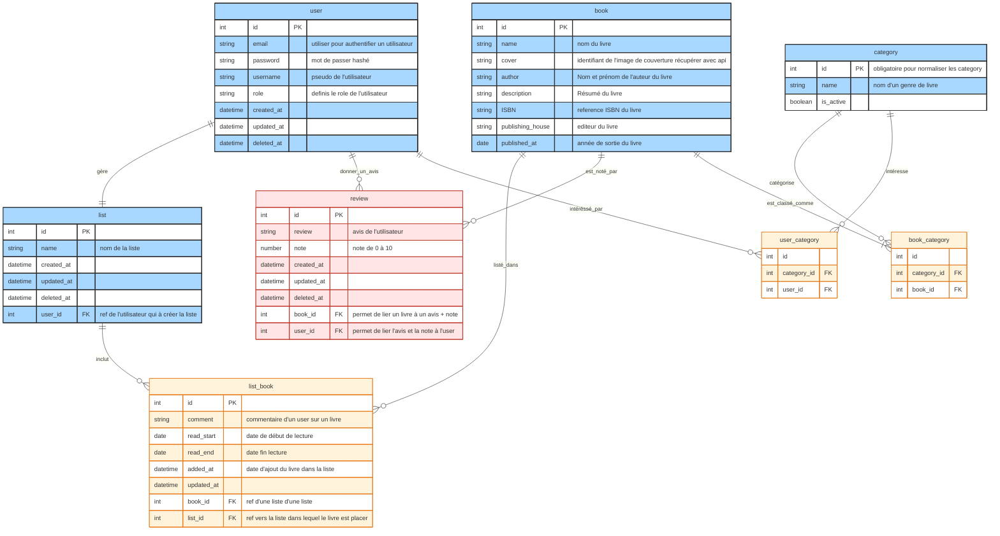

# ERD

Légende :

- Bleu - table entité
- Orange - table pivot
- Rouge - evolution future

# MVP

```mermaid
erDiagram
user ||--|| list : gère
list ||--o{ list_book : inclut
book ||--o{ list_book : listé_dans
user ||--o{ review: donner_un_avis
book ||--o{ review: est_noté_par
book ||--|{ book_category : est_classé_comme
category ||--o{ book_category : catégorise
category ||--o{ user_category : intéresse
user ||--o{ user_category : intéréssé_par

user {
  int id PK
  string email "utiliser pour authentifier un utilisateur"
  string password "mot de passer hashé"
  string username "pseudo de l'utilisateur"
  string role "definis le role de l'utilisateur"
  datetime created_at
  datetime updated_at
  datetime deleted_at
}

list {
  int id PK
  string name "nom de la liste"
  datetime created_at
  datetime updated_at
  datetime deleted_at
  int user_id FK "ref de l'utilisateur qui à créer la liste"
}

list_book {
  int id PK
  string comment "commentaire d'un user sur un livre"
  date read_start "date de début de lecture"
  date read_end "date fin lecture"
  datetime added_at "date d'ajout du livre dans la liste"
  datetime updated_at
  int book_id FK "ref d'une liste d'une liste"
  int list_id FK "ref vers la liste dans lequel le livre est placer"
}

book {
  int id PK
  string name "nom du livre"
  string cover "identifiant de l'image de couverture récupérer avec api"
  string author "Nom et prénom de l'auteur du livre"
  string description "Résumé du livre"
  string ISBN "reference ISBN du livre"
  string publishing_house "editeur du livre"
  date published_at "année de sortie du livre"
}

review {
  int id PK
  string review "avis de l'utilisateur"
  number note "note de 0 à 10"
  datetime created_at
  datetime updated_at
  datetime deleted_at
  int book_id FK "permet de lier un livre à un avis + note"
  int user_id FK "permet de lier l'avis et la note à l'user"
}

category {
  int id PK "obligatoire pour normaliser les category"
  string name "nom d'un genre de livre"
  boolean is_active
}

book_category {
  int id
  int category_id FK
  int book_id FK
}

user_category {
  int id
  int category_id FK
  int user_id FK
}

classDef entity fill:#A8D8FF,stroke:#333,stroke-width:2px
classDef pivot fill:#fff4db,stroke:#e67e22,stroke-width:1px
classDef evolution fill:#ffe5e5,stroke:#c0392b,stroke-width:1px

class review evolution
class user,list,book,category entity
class user_category,book_category,list_book pivot

```
